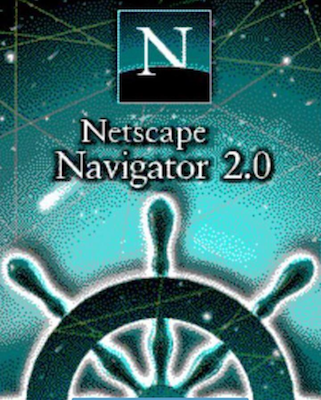
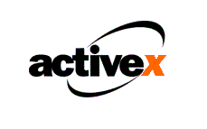

_This article is the first of a series about WebAssembly, based on the talk I gave on [MedellinJS](https://medellinjs.org): *[WebAsembly 101](https://wasm101.surge.sh)*._

> Those who cannot remember the past are condemned to repeat it.

The famous phrase, by George Santayana, is of special relevance in computer sciences. I've been in this field long enough to see patterns and technologies become a fashion, then be replaced by new shinier techs, and just a few years later come back as the next big thing. This is happening right now with the functional programming paradigm, which is experiencing a revival after 40 years of lying dormant. Don't get me wrong, I'm not against this cycle, I think its needed to keep evolving. What I don't like is discarding everything to move to the newest thing, just because everybody is talking about it. Anyway, that's not the point of this article.

I like looking at the history of things, how they come to be. That is why it is no wonder that when I first got interested in WebAssembly, I wanted to know how it originated, a quest that took me on a trip back in time almost to the origins of the World Wide Web. Let me take you through it.

### 1995

The year was 1995. Microsoft launched a massive marketing campaign for its new revolutionary (for then) operating system _Windows 95_, and _America Online_ and _Prodigy_ started offering access to the World Wide Web for the first time.

  

At the end of this year, Netscape launched version 2.0 of their browser: Netscape Navigator. This release included multiple improvements and new features, among them 2 technologies that will revolutionize the web and that we're still using nowadays: Javascript, and of course animated GIF's.

Javascript was created by Brendan Eich on September 1995, [in just 10 days][1]. Although it initially was called Mocha, and later LiveScript, it was renamed to Javascript. This was a marketing tactic designed to ride on the increasing popularity and expectation created around Sun's Microsystems Java programming language. This decision, unfortunately, started the biggest confusion in programming language naming in history, the effects of which are still being felt by HR departments around the world even today.

Initially, Javascript was intended to be a 'glue' language, to be used by informal developers and designers to join Java applet components and automate interactions. The general agreement at the time was that any high-level development should be done as Applets in Java.

### 1996

As the popularity of the World Wide Web exploded, more than doubling between 1995 and 1996, developers turned to different solutions to take advantage of the platform.

  

Java, publicly launched that same year, promised total portability and targeted the web with their Applets. It is easy now to hate Java Applets as a technology, but for a long time, it was the preferred way to bring application programming to the web in a cross-platform manner.

  

Microsoft, of course, also provided an alternative to Java Applets. By bringing support for ActiveX controls to their Internet Explorer 3.0 (1996) browser they intended to capitalize on Windows developers eagerness to port their code to the Web. ActiveX was hard to secure, and not as portable as Java Applets, but it was very successful in enterprise Intranet applications, and I bet there still are some apps within big enterprises or government corporations that use it and run only on Internet Explorer.

  

That same year a small company called Macromedia (later acquired by Adobe) released their Flash web plugin, which had great author tools for creating multimedia content. Flash took the web by storm. By 2005 almost 98% of computers had the flash plugin installed[2], and weren't for Steve Jobs stubbornness not to support flash in its iOS platform it might still be in use, instead of HTML5/Javascript.

### 2004

Even from the worst ideas, things of value can be rescued. In 1999, while developing their Microsoft Exchange 2000 mail server, the Outlook Web App team developed the ActiveX XML-HTTP Component. The idea was brilliant, opening for the first time the potential to communicate with a server without reloading a web page. It was an idea so powerful that it wasn't long before it was adopted by all browser vendors: by 2002 Mozilla had implemented a version of it into its Javascript API, calling it XMLHttpRequest. Two years later Safari also implemented it.

  

The javascript support for XMLHttpRequest was instrumental in the set of technologies later known as Ajax, and it revolutionized the kind of apps that could be developed in Javascript.

However, at that point in time few developers understood the potential of Javascript to create complex apps, and it wasn't until Google launched Gmail that same year that the true potential of Javascript/AJAX applications started to shine.

### 2013

With the advent of complex javascript applications and larger codebases, the execution speed of Javascript started to gain relevance.

Within the end of 2008 and beginning of 2009, the new browser engines were launched: V8, TraceMonkey, and Nitro. It could be said that a performance war between browser makers started, as a result, new technologies like JIT compilers and dynamic code optimization were introduced, and made Javascript code execution faster leading in some cases to close to native execution speeds, which were previously unthinkable.

By the year 2013 browsers were extremely fast. However, developers wanted more from the platform. Additionally, a huge amount of already written C/C++ code exists and it was very hard to port it to JavaScript.

With the goal of bringing C/C++ development to the browser, Google launched in 2014 their Native Client (NaCl) SDK. NaCl allowed compiling C/C++ code for using it on the browser. However their security model and general architecture made it really hard to be ported to other browser engines beside Chrome, and it was rejected by the rest of the vendors.

At the same time, a group of developers in Mozilla was working on ASM.js: a subset of Javascript intended as a compilation target. It included type hints intended to make the type inference and code optimization faster on browsers. ASM.js allowed to take C/C++ code and compile it to Javascript deployable in all browsers. This approach, though more portable than NaCl, wasn't able to guarantee consistent performance across browsers, and huge differences in execution speed between different browser engines were a constant.

### 2015

The almost simultaneous effort from Google and Mozilla to compile C/C++ for the web made evident the need for a standard solution to this problem.

  

On June 17, 2015, Javascript creator Brandon Eich and Mozilla's Luke Wagner (one of the creators of ASM.js) announced the start of development of WebAssembly.

It was something unprecedented and unexpected. The teams of the 4 main browser engines, which have a hard time agreeing on the semantic of CSS attributes, managed to reach an agreement with regards to a standard binary format for the Web: WebAssembly.

Even more incredible was the speed of development. Less than a year later, on March 15, 2016, WebAssembly was demonstrated running [Unity's Angry Bots][3] in Firefox, Google Chrome, and Microsoft Edge.

### 2017

On March 2017 the initial phase of the MVP was declared complete. And by the end of September 2017, Safari 11 included support for Wasm, finally completing support on the main 4 browser engines, and making WebAssembly the first binary format universally supported on the Web Platform.

### 2018 and the future

We're slowly seeing the huge impact of WebAssembly on the web. Autodesk just launched a version of Autocad for the web taking advantage of WebAssembly, and both of the main game engines already support it as their default compilation target for WebGL.

However, we're just getting started, and this is just the MVP version. Can you imagine what is the next big usage of WebAsembly? Will it unleash a second performance revolution on the Web?

Stay tuned for a next article, where I'll discuss the future of WebAssembly.

[1]: https://www.computer.org/csdl/mags/co/2012/02/mco2012020007.pdf
[2]: https://web.archive.org/web/20070516090612/http://news.zdnet.co.uk/internet/0%2C1000000097%2C39211831%2C00.htm
[3]: https://beta.unity3d.com/jonas/AngryBots/
